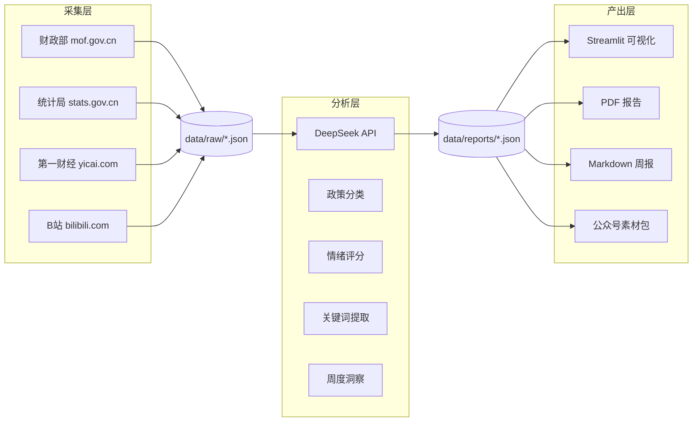

# 📊 财政政策舆情监测系统

> 一条命令完成：数据采集 → AI 分析 → 报告生成 → 交互式可视化


---

## 🎯 项目简介

面向财政政策研究的**全流程自动化舆情监测工具**，专为应用经济学研究生面试设计。

- 📡 **自动采集** — 财政部、统计局、第一财经、B站等 4 源
- 🤖 **AI 分析** — DeepSeek API 政策分类 + 情绪评分 + 关键词提取 + 周度洞察
- 📈 **可视化** — Streamlit 交互界面，8 周趋势图，政务蓝主题
- 📝 **报告生成** — Markdown 周报 + PDF 报告 + 公众号素材包
- ⏰ **定时任务** — 周五 17:00 自动运行全流程

---

## ⚙️ 快速开始

### 在线体验（已部署）

👉 [streamlit.app 链接] — 替换为你的实际部署链接

### 方式一：Docker（推荐）

```bash
# 1. 配置 API Key
cp .env.example .env
# 编辑 .env，填入 DEEPSEEK_API_KEY

# 2. 启动
docker compose up -d

# 3. 访问
open http://localhost:8501
```

### 方式二：本地运行

```bash
# 1. 配置 API Key
cp .env.example .env
# 编辑 .env，填入 DEEPSEEK_API_KEY

# 2. 安装依赖
pip install -r requirements.txt

# 3. 一键全流程
python main.py

# 4. 或双击桌面快捷方式
# 自动启动 Streamlit + 打开浏览器 → http://localhost:8501
```

---

## 🏗️ 架构



### 数据流

```
data_collector.py  →  data/raw/{week}.json
analyzer.py        →  data/reports/{week}.json
report_generator.py →  output/charts/, output/wechat/
streamlit_app.py   →  http://localhost:8501
```

---

## 📂 项目结构

```
├── data_collector.py      # 数据采集（4源 + B站多关键词 + 日期提取）
├── analyzer.py             # AI分析（DeepSeek API + 本地规则降级）
├── report_generator.py     # 报告生成（图表/PDF/Markdown/公众号）
├── streamlit_app.py        # 可视化界面（政务蓝主题）
├── config.py               # 全局配置（数据源/颜色/重试参数）
├── main.py                 # 一键运行入口
├── run_weekly.py           # 定时任务脚本
├── test.py                 # 6项基础测试
├── 启动仪表盘.bat           # 双击启动 Streamlit
├── requirements.txt        # Python 依赖
├── .env.example            # API Key 配置模板
│
├── data/
│   ├── raw/                # 原始采集数据
│   └── reports/            # 已生成周报
│
├── output/
│   ├── charts/             # 图表 + PDF + Markdown
│   └── wechat/             # 公众号素材包
│
├── .streamlit/
│   └── config.toml         # Streamlit 主题配置
│
└── docs/
    └── superpowers/specs/  # 设计文档
```

---

## 📊 技术栈

| 组件 | 选择 | 理由 |
|------|------|------|
| 数据采集 | requests + HTML 解析 | 轻量、零额外依赖 |
| 日期提取 | 正则匹配（中文/ISO/斜杠） | 覆盖财政部/统计局/财经/B站 |
| AI 分析 | DeepSeek API | 性价比最高、中文政策文本能力强 |
| 可视化 | Streamlit | Python 原生、零前端经验 |
| 图表 | matplotlib + wordcloud | 成熟稳定 |
| 报告 | fpdf2 + Markdown | 纯 Python、零系统依赖 |

---

## 📋 面试问答

| 面试官可能问 | 回答思路 |
|-------------|---------|
| **为什么用 DeepSeek？** | 性价比最高（百万 token ¥1）、中文政策文本理解能力强、API 兼容 OpenAI 格式可无缝切换 |
| **数据如何保证准确？** | 每篇文章带原始 URL 可追溯；发布日期从 HTML 提取而非采集时间；分析基于文章全文而非标题 |
| **为什么加 B站？** | 财政政策效果最终体现在公众感知上，视频评论和弹幕反映真实舆情 |
| **架构设计思路？** | 模块化单体 — 4 个独立模块通过 JSON 文件解耦，每个模块可独立运行/测试/替换 |
| **为什么不用数据库？** | 项目规模适合文件存储，零配置部署，面试官可当场运行验证 |
| **如果 API 挂了怎么办？** | 三级容错：重试指数退避 → 连续 3 次失败进入降级模式 → 本地关键词规则完成分析 |
| **如何扩展到更多数据源？** | SOURCES 配置在 config.py 中，新增一条 dict 即可；日期/标题/正文提取通过同一套解析函数 |
| **有哪些技术亮点？** | 真实日期提取 + 按周归集、API 降级保底、跨年趋势图排序、一键桌面启动 |

---

## 🛠️ 可用命令

```bash
python main.py                          # 一键全流程
python main.py --step collect           # 仅采集
python main.py --step analyze           # 仅分析
python main.py --step report            # 仅生成报告
python main.py --step streamlit         # 仅启动可视化
python test.py                          # 运行测试
python run_weekly.py                    # 定时任务
```

---

## ✅ 项目状态

- ✅ 4 数据源 + 真实日期提取
- ✅ DeepSeek API 分析（分类/情绪/关键词/周洞察）
- ✅ 8 周历史数据（含趋势图）
- ✅ PDF / Markdown / 公众号素材
- ✅ Streamlit 政务蓝主题
- ✅ 重试指数退避 + API 降级
- ✅ 桌面一键启动
- ✅ 6/6 基础测试通过

---

## 📝 许可证

MIT

*本系统由 AI 辅助开发，数据来源可追溯，分析基于 DeepSeek API*
